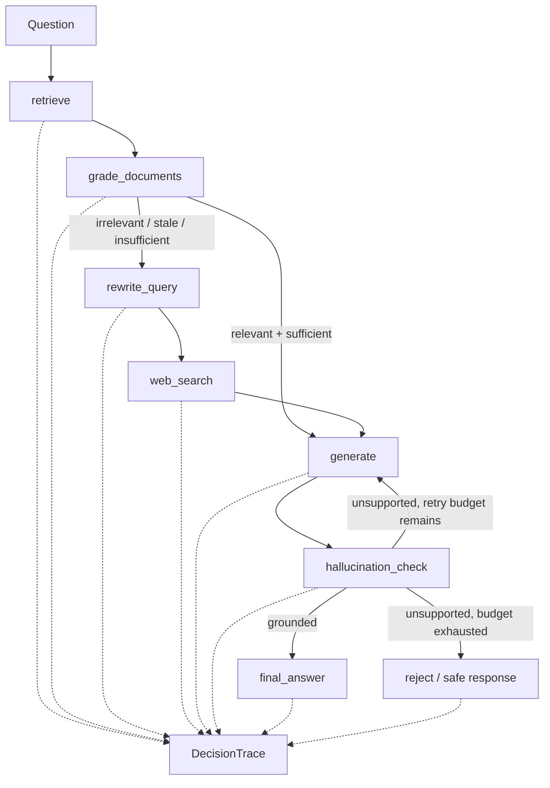

# Enterprise AI Engineering Patterns

Hands-on, tutorial-style reference implementations for learning how to build **enterprise-grade AI systems** with clean architecture, explicit control flow, observability, testing, and provider isolation.

This repository is intentionally different from "one notebook + one prompt + one framework" tutorials. Each use case starts with a realistic enterprise problem, then builds the smallest complete system that makes the important AI engineering decisions visible and testable.

> **Learning goal:** build it, trace it, break it, test it, and be able to explain the architecture and trade-offs confidently in an interview.

## Repository Status

🚧 **Early build — architecture and first use case are being implemented.**

The repository currently establishes the direction and design contract for the first tutorial. Commands, screenshots, benchmarks, and runnable setup instructions will be added only as the corresponding implementation is verified.

## What This Repository Teaches

Across the tutorials, the focus is not only on *what a framework can do*, but on the engineering questions that appear when AI enters a real system:

- Where should probabilistic AI be used, and where should deterministic controls remain authoritative?
- How do we keep LLM, vector-store, search, and model-provider SDKs out of core business abstractions?
- How do we make an agentic workflow inspectable instead of hiding decisions inside a chain?
- What happens when retrieval is weak, knowledge is stale, or the model invents an answer?
- How do we test routing decisions and failure paths without calling real providers in every unit test?
- How do we retain an audit trail of what the system retrieved, decided, generated, and rejected?
- How do we swap infrastructure providers without rewriting the use case?

The recurring design signature is:

**deterministic core + intelligent edge + explicit verification + observable decisions.**

---

# Use Case 01 — Corrective RAG for Kubernetes Troubleshooting

> 📁 **Use Case Directory:** [`patterns/01_corrective_rag`](patterns/01_corrective_rag/README.md)
>
> **Important terminology:** this use case implements **Corrective RAG (CRAG) using LangGraph**. It is not GraphRAG in the knowledge-graph sense.

## The Problem

Imagine an internal platform team has a local troubleshooting knowledge base built from official Kubernetes documentation. The documentation was downloaded once, approved, embedded, and then left untouched.

That is realistic — and dangerous.

The local knowledge base is useful for common incidents, but over time it becomes incomplete or stale compared with current vendor documentation. A normal RAG assistant may still retrieve something vaguely related and confidently generate an outdated remediation step.

This tutorial deliberately creates that failure condition.

### Deliberately stale local KB

- roughly **30–40 official Kubernetes troubleshooting/reference documents**
- downloaded as a **frozen snapshot**
- chunked and embedded into **Chroma**
- snapshot metadata records source URL, retrieval date, and relevant version information
- the snapshot is **not silently refreshed** during a query

The stale snapshot is not a limitation to hide. It is the mechanism that gives corrective retrieval a real job to do.

## Why this is a better CRAG exercise than "chat with a document"

In a conventional demo, retrieval either succeeds or the application gives a weak answer. Here, the graph must make meaningful decisions:

1. **Is the local evidence actually relevant and sufficient?**
2. **If not, should the query be rewritten and corrected with current web evidence?**
3. **Is the generated answer supported by the evidence, or did the model invent something?**
4. **If generation is unsupported, should the system retry or refuse rather than ship a plausible-looking answer?**

That makes retrieval grading and hallucination checking part of system behavior rather than decorative nodes in a diagram.

---

## Three Golden Test Queries

The tutorial is built around three deterministic acceptance scenarios. Each query is designed to force a different route through the graph.

### 1. Local knowledge is sufficient

```text
Why does kubectl get pods show CrashLoopBackOff?
```

Expected route:

```text
retrieve → grade_documents → generate → hallucination_check → answer
```

The topic is intentionally well represented in the frozen local snapshot. Relevant local evidence should be enough to answer without a web fallback.

### 2. Local knowledge is stale or insufficient

```text
How do I handle pod eviction under Kubernetes 1.32's new node-pressure eviction policy?
```

Expected route:

```text
retrieve
  → grade_documents
  → rewrite_query
  → web_search
  → generate
  → hallucination_check
  → answer
```

This scenario targets information that the chosen snapshot does not adequately cover. The exact snapshot date/version will be pinned when the corpus is created so the test remains reproducible.

### 3. The premise itself is fabricated

```text
What does the --enable-quantum-scheduler flag do in kubectl?
```

Expected behavior:

```text
retrieve / web_search
  → generate
  → hallucination_check
  → retry or reject
  → safe unsupported-answer response
```

The flag is intentionally fictitious. The system must not manufacture an explanation merely because the question sounds technically plausible.

Retries are bounded. If the answer cannot be grounded after the configured retry policy, the system returns an explicit unsupported-answer response and records why it refused.

---

# The LangGraph Workflow



The graph is useful because the control flow is explicit. The important learning outcome is not simply "how to create LangGraph nodes"; it is how to define **state, decisions, retry boundaries, evidence, and safe terminal states**.

---

# Clean Architecture

The architectural rule is simple:

> **Core policy does not depend on vendor infrastructure.**

The UI never calls LangGraph directly. The FastAPI layer never reaches into Chroma or Tavily. The application use case does not import OpenAI, Ollama, Chroma, or Tavily SDKs. Infrastructure implements capabilities defined by inward-facing ports.

```text
┌──────────────────────────────┐
│ UI — React / TypeScript      │
│ Chat + Decision Trace        │
└──────────────┬───────────────┘
               │ typed HTTP/SSE client
               ▼
┌──────────────────────────────┐
│ API — FastAPI                │
│ DTOs, validation, middleware │
└──────────────┬───────────────┘
               │
               ▼
┌──────────────────────────────┐
│ Application                  │
│ AnswerQuestionUseCase        │
│ LangGraph orchestration      │
└──────────────┬───────────────┘
               │ domain ports
               ▼
┌──────────────────────────────┐
│ Domain — pure Python         │
│ Entities + Ports             │
└──────────────────────────────┘
               ▲
               │ implements ports
┌──────────────┴───────────────┐
│ Infrastructure               │
│ Chroma / LLM / Tavily / DB   │
└──────────────────────────────┘

composition.py wires concrete adapters to ports at startup.
```

### A practical note about LangGraph

The **Domain** remains framework-free. The **Application** layer uses LangGraph as an orchestration mechanism, but it talks to retrieval, grading, generation, search, hallucination checking, and trace persistence only through domain ports.

This keeps the tutorial focused on LangGraph while still isolating vendor-specific infrastructure.

---

## Layer Responsibilities

### Domain — pure Python

No LangChain, LangGraph, FastAPI, Chroma, OpenAI, Tavily, Pydantic, or database imports.

Core entities/value objects:

- `Question`
- `Document`
- `GradedDocument`
- `Answer`
- `DecisionTrace`
- grading / grounding result types

Core ports:

- `Retriever`
- `RelevanceGrader`
- `Generator`
- `WebSearchProvider`
- `HallucinationChecker`
- `DecisionTraceRepository`

The Domain defines **what capabilities the use case needs**, not how a vendor provides them.

### Application

Primary use case:

```text
AnswerQuestionUseCase
```

Responsibilities:

- initialize graph state
- execute the compiled LangGraph workflow
- invoke capabilities through domain ports
- apply retry/termination policy
- return the answer together with its decision trace

The Application layer must never know whether retrieval came from Chroma, generation came from OpenAI or Ollama, or web search came from Tavily.

### Infrastructure

Concrete adapters implement domain ports, for example:

```text
ChromaRetriever
OpenAIRelevanceGrader
OpenAIGenerator
OllamaGenerator
TavilyWebSearchProvider
LLMHallucinationChecker
SQLiteDecisionTraceRepository
```

Infrastructure owns vendor SDK imports, persistence details, HTTP clients, timeouts, retries, and provider-specific translation.

### API — FastAPI

The only layer that knows about HTTP.

Planned responsibilities:

- Pydantic request/response DTOs
- input validation
- correlation ID middleware
- authentication boundary
- rate limiting
- exception mapping
- SSE endpoint for streaming answer events/tokens
- API-to-application mapping

### UI — React + TypeScript

Two primary views:

1. **Chat** — ask troubleshooting questions and receive grounded answers with citations/evidence.
2. **Trace panel** — see the route the request took, which graders fired, why web search was used, and whether generation was rejected or retried.

The UI communicates only through a typed API client. It never imports or calls LangGraph.

---

# DecisionTrace: Make the AI System Explain Its Behavior

Every request gets a correlation ID and a `DecisionTrace`.

A trace should make questions like these answerable after the request completes:

- Which graph nodes executed?
- Which documents were retrieved?
- What relevance score/decision was produced?
- Why did the workflow use or skip web search?
- What rewritten query was used?
- Which evidence was supplied to generation?
- Did the hallucination checker pass or fail?
- How many retries occurred?
- What terminal state produced the response?
- Which provider/model configuration was used?

The trace is persisted through a repository port. The first implementation will use SQLite for zero-infrastructure local learning; PostgreSQL can be introduced later without changing Domain or Application contracts.

---

# Proposed Repository Structure

```text
enterprise-ai-engineering-patterns/
├── README.md
├── patterns/
│   └── 01_corrective_rag/
│       ├── README.md
│       ├── pyproject.toml
│       ├── .env.example
│       ├── src/
│       │   ├── domain/
│       │   │   ├── entities/
│       │   │   ├── ports/
│       │   │   └── policies/
│       │   ├── application/
│       │   │   ├── graph/
│       │   │   └── use_cases/
│       │   ├── infrastructure/
│       │   │   ├── retrieval/
│       │   │   ├── llm/
│       │   │   ├── search/
│       │   │   └── persistence/
│       │   ├── api/
│       │   │   ├── routers/
│       │   │   ├── dto/
│       │   │   └── middleware/
│       │   └── composition.py
│       ├── scripts/
│       │   └── build_kb_snapshot.py
│       ├── data/
│       │   └── kb_manifest.json
│       └── tests/
│           ├── unit/
│           ├── integration/
│           └── acceptance/
└── ui/
    └── ... React / TypeScript app
```

The exact structure may evolve during implementation. Any change should preserve the dependency rule rather than preserve folders for their own sake.

---

# Technology Stack — Use Case 01

| Concern | Technology | Why it is here |
|---|---|---|
| Workflow orchestration | LangGraph | Explicit stateful routing, loops, and terminal decisions |
| AI abstractions/helpers | LangChain where useful | Integration utilities without allowing chains to become the architecture |
| Local vector store | Chroma | Zero-infrastructure learning setup |
| Generation/grading | OpenAI and/or Ollama adapters | Demonstrate provider isolation and local/cloud options |
| Web correction | Tavily | Current external evidence when local knowledge is insufficient |
| API | FastAPI | Typed Python HTTP boundary and streaming support |
| Configuration | `pydantic-settings` + `.env` | Explicit environment-based configuration |
| Trace persistence | SQLite first | Queryable audit trail with no extra service required |
| UI | React + TypeScript | Chat plus visual execution trace |
| Tests | pytest | Unit, integration, and acceptance coverage |

---

# Testing Strategy

The test pyramid is intentionally split by architectural boundary.

## Unit tests — Domain and Application

Fast and provider-free.

Use fakes/mocks for ports to verify:

- relevant documents take the local path
- insufficient documents trigger rewrite + web search
- web search is skipped when local evidence is sufficient
- hallucination failure triggers a bounded retry
- retry exhaustion produces a safe rejection
- `DecisionTrace` records the actual path

## Integration tests — Infrastructure

Verify adapters against their real integration boundaries where practical:

- Chroma ingestion and similarity retrieval
- OpenAI/Ollama structured grading contracts
- Tavily result mapping
- SQLite trace persistence

External-provider tests should be opt-in so ordinary unit-test runs do not consume API quota.

## Acceptance tests — the three golden queries

The three tutorial queries become executable acceptance scenarios. The target is not only correct wording; it is the **expected route and safety behavior**.

---

# Learning Path

Each use case in this repository should be worked through in roughly this order:

1. **Understand the failure mode** — why ordinary RAG is not enough.
2. **Model the domain** — entities, decisions, and capability ports before vendor code.
3. **Build the deterministic skeleton** — fake adapters and executable graph routing.
4. **Add local retrieval** — snapshot, chunk, embed, retrieve.
5. **Add relevance grading** — decide whether local evidence is sufficient.
6. **Add correction** — rewrite and search current external sources.
7. **Add generation** — produce an evidence-constrained answer.
8. **Add hallucination checking** — ground, retry, or reject.
9. **Persist the trace** — make every important decision queryable.
10. **Expose the API** — validated HTTP/SSE boundary.
11. **Build the trace UI** — visualize what the graph actually did.
12. **Evaluate the golden scenarios** — prove the intended paths.
13. **Explain the trade-offs** — convert implementation experience into interview-ready reasoning.

---

# Interview Outcomes

After completing Use Case 01, you should be able to answer questions such as:

- What problem does Corrective RAG solve that normal RAG does not?
- Why is this CRAG rather than GraphRAG?
- Why use LangGraph instead of a linear LangChain chain?
- What belongs in graph state?
- How do you decide whether retrieved context is sufficient?
- How do you prevent an LLM grader from becoming an unexamined single point of truth?
- When should the system search the web?
- How do you avoid infinite agentic retry loops?
- How do you test a LangGraph workflow without calling OpenAI or Tavily?
- Why are `Retriever` and `Generator` ports defined inward rather than importing concrete providers in the use case?
- Where should LangGraph live in a clean architecture?
- How would you swap Chroma for another vector store?
- What should happen when both the local KB and live search cannot support the user's premise?
- What evidence would you keep for auditability in a production troubleshooting assistant?
- What changes before allowing this assistant to execute remediation actions rather than only recommend them?

The goal is to answer from code you have built and failure paths you have observed, not from memorized definitions.

---

# Scope Boundaries for Use Case 01

To keep the tutorial deep rather than broad, the first version intentionally does **not** attempt to become a full Kubernetes operations platform.

In scope:

- read-only troubleshooting assistance
- frozen local KB
- corrective web-search fallback
- relevance and hallucination grading
- bounded retries / safe refusal
- evidence + decision trace
- provider abstraction
- API + trace UI
- unit, integration, and golden-path acceptance tests

Out of scope for the first version:

- autonomous execution of `kubectl` commands
- production cluster credentials
- write access to Kubernetes
- multi-agent orchestration for its own sake
- enterprise SSO implementation
- a generalized agent framework
- distributed production infrastructure

These can become later exercises only when they introduce a new engineering lesson.

---

# Future Patterns

Additional tutorials will be added selectively. A topic belongs here only if it introduces a distinct enterprise AI engineering problem rather than repeating the same chatbot pattern with another framework.

Potential areas include:

- human-controlled agentic workflows
- Model Context Protocol (MCP) integration
- AI evaluation and regression testing
- observability and OpenTelemetry for LLM/agent workflows
- prompt-injection and data-boundary controls
- model routing and cost/latency trade-offs
- role-aware enterprise retrieval
- durable agent state and recovery

The repository will prefer **fewer, complete, well-tested patterns** over a large catalog of half-built demos.

---

# Contributing

Contributions are welcome as the implementations mature.

A new tutorial or adapter should preserve these rules:

1. Start from a concrete failure mode or enterprise workflow.
2. Keep Domain free of third-party dependencies.
3. Keep provider SDKs in Infrastructure.
4. Make important routing decisions observable.
5. Include failure-path tests, not only happy-path demos.
6. Do not claim production readiness that has not been verified.
7. Explain architecture trade-offs and limitations in the tutorial README.

---

# License

Licensed under the [MIT License](LICENSE).
